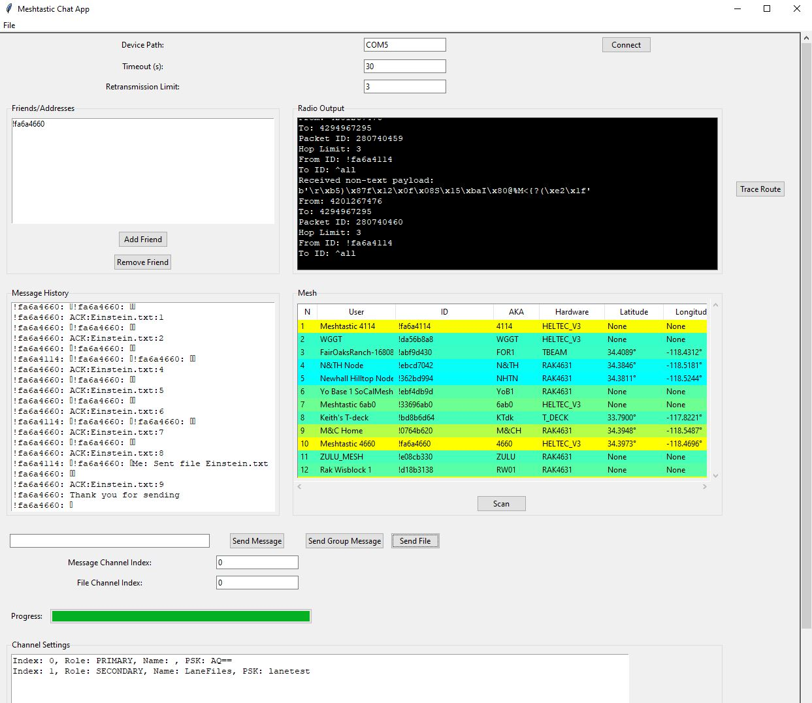

# Meshtastic Chat Desktop Server

Attention: This version is under development
Meshtastic Chat Desktop Server is a desktop/server application designed for Meshtastic device users who want to send and receive messages using their Meshtastic device via their desktop. The application supports Windows, Linux, and Raspberry Pi.

To run :
pip install -r requirements.txt

python meshtastic_chat_desktop.py




## Features

- Send and receive messages/files using Meshtastic devices
- Supports Windows, Linux, and Raspberry Pi
- Easy setup with a virtual environment
- This version is under development!

## Installation

### Prerequisites

- Python 3.x

### Cloning the Repository

Clone the repository to your local machine:

```sh
git clone https://github.com/laneboyerre/meshtastic_chat_desktop.git
cd meshtastic_chat_desktop

### Additional Tips:

- **Please email lane.boyer.re@gmail.com for any feature requests or trouble shooting.

This `README.md` provides a clear and comprehensive guide for users to understand, install, and use your application. If you have any specific sections or additional information you'd like to include, let me know!
