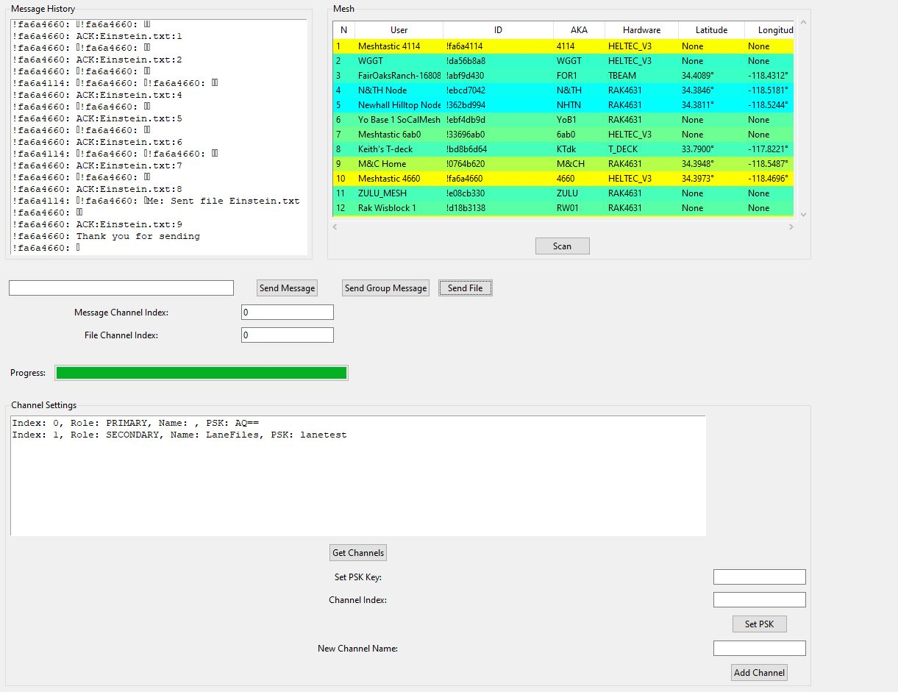
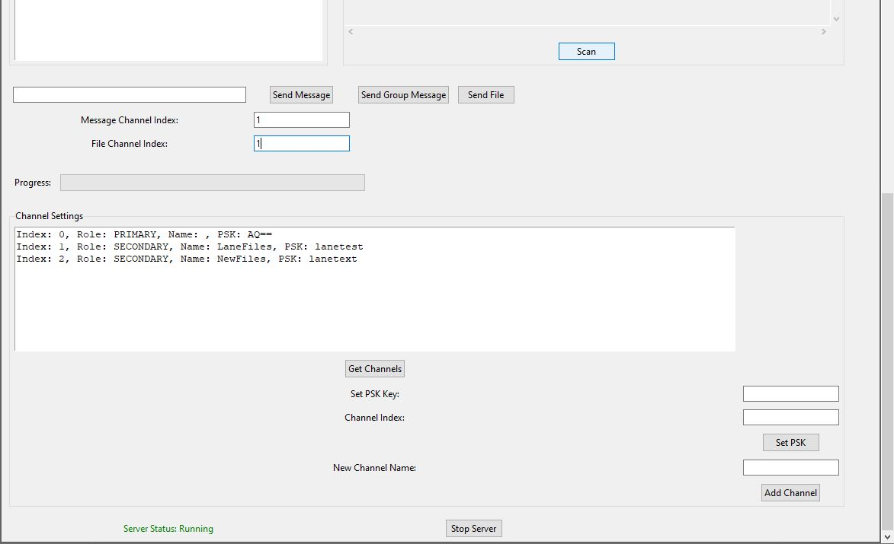
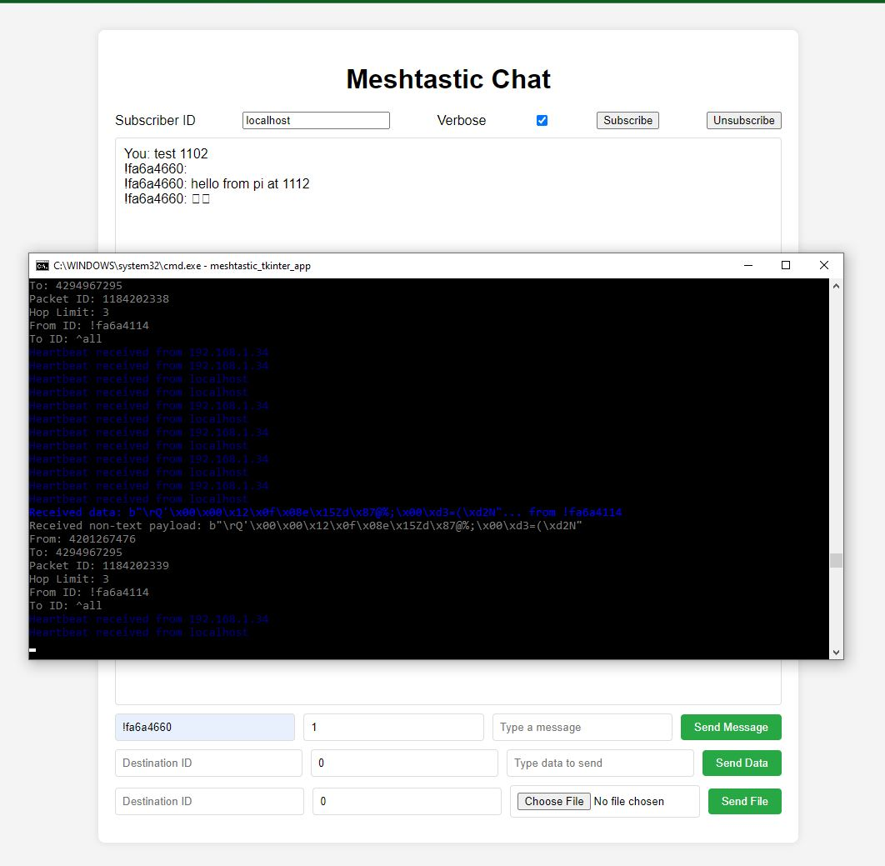
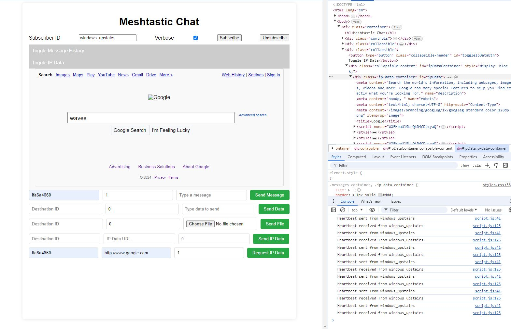

# Meshtastic Chat Desktop Server

Attention: This version is under development!

Meshtastic Chat Desktop Server is a desktop/server application designed for Meshtastic device users who want to send and receive messages using their Meshtastic device via their desktop. The application supports Windows, Linux, and Raspberry Pi.

For high speed data transfer use Meshtastic CLI ( or set in app ) : meshtastic --set lora.modem_preset SHORT_FAST --set lora.channel_num 0

Default setting is : meshtastic --set lora.modem_preset LONG_FAST

To run :
pip install -r requirements.txt

python meshtastic_chat_desktop.py







## Features

- Send and receive messages/files/Web Browsing! (under development) using Meshtastic devices
- Supports Windows, Linux, and Raspberry Pi
- Easy setup with a virtual environment
- This version is under development!

## Installation

### Prerequisites

- Python 3.x

### Cloning the Repository

Clone the repository to your local machine:

```sh
git clone https://github.com/laneboyerre/meshtastic_chat_desktop.git
cd meshtastic_chat_desktop

```

### Running Unit Tests:

We are currently using ```pytest``` and it should have installed after running ```pip install -r requirements.txt```

When ready to run unit tests, run ```pytest``` from the root dir of the repo.

```
$ pytest
================= test session starts==================================================
platform win32 -- Python 3.10.7, pytest-7.3.1, pluggy-1.0.0
rootdir: F:\Documents\workdir\meshtastic_chat_desktop
configfile: pytest.ini
plugins: anyio-3.6.1
collected 2 items

tests\friends_modules_tests\friend_tests.py .                                                                                                                                                                  [ 50%] tests\friends_modules_tests\pickle_impl_tests.py .                                                                                                                                                             [100%] 

================= 2 passed in 0.12s =========================

```
### Additional Tips:

- **Please email lane.boyer.re@gmail.com for any feature requests or trouble shooting.

This `README.md` provides a clear and comprehensive guide for users to understand, install, and use your application. If you have any specific sections or additional information you'd like to include, let me know!
